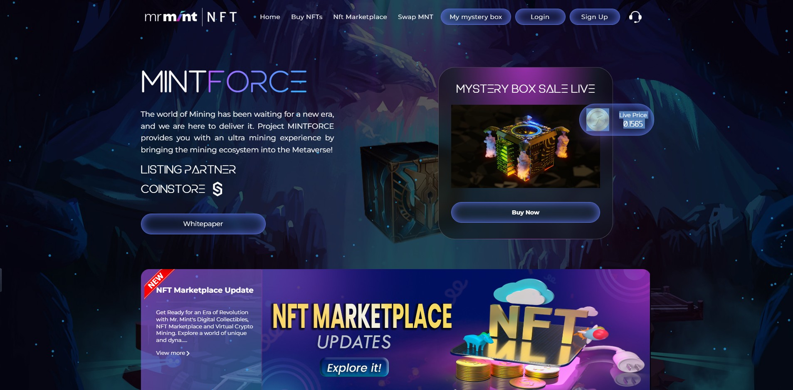
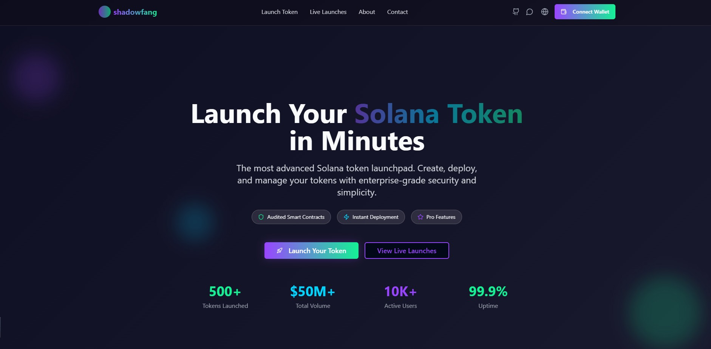
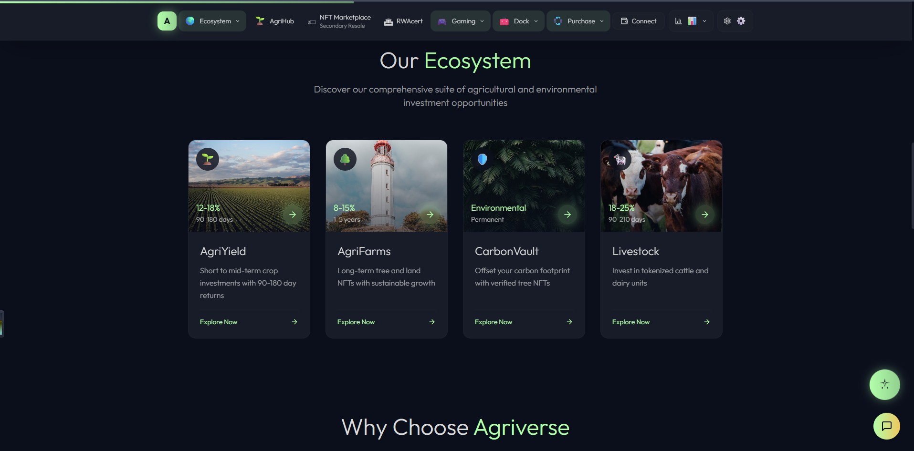

    

  

    

 

    Just call me <b>Rusty</b>, As a Blockchain Developer, I love working in Solana, EVM, Bitcoin, and Sui Blockchain.
     I am one of the Developers who loves Trading bot, P2E Games, Nft Marketplace, Meme Coin and Nft Collection Launch.

 

    
    
     
    

---

## 🛠️ Languages & Tools

    

## 🛠️ Featured Projects

<h4><u><strong>⭐ &nbsp;LOGARITHM GAMES Mint</strong></u> &nbsp;(NFT Mint : BNB)</h4>

This site is a mint site for LOGARITHM GAMES.

I performed thefront-end part and contract part here. Here, BNB tokens were used.

 React interacts with smart contracts to support NFT marketplace functionality: wallet connection, listing, buying/selling of NFTs, metadata via IPFS or similar, and a backend or smart contracts in Solidity.

- Live: <a href="https://yini-marketplace.vercel.app/">LOGARITHM GAMES MintNFT</a>

 

<h4><u><strong>⭐ &nbsp;LOGARITHM GAMES Mint</strong></u></h4>

Purechain Capital is a venture capital firm dedicated to advancing the blockchain industry through strategic investments in innovation and technology.

Our expertise lies in nurturing startups and accelerating their growth in the fast-paced world of blockchain.

- Purechain Capital : React.js, Javascript, Tailwind CSS, Animation, SmartContract, Supabase, ETH, Solidty 

- Live: <a href="https://pure-chain-capital-demo.vercel.app/">Purechain Capital</a>

  

<h4><u><strong>⭐ &nbsp;MINTFORCE</strong></u> &nbsp;(NFT Mint : BNB,ETH)</h4>

The world of Mining has been waiting for a new era, and we are here to deliver it. Project MINTFORCE provides you with an ultra mining experience by bringing the mining ecosystem into the Metaverse!.

- Live: <a href="https://nft.mrmint.io/">Mr MINTFORCE</a>

nft.mrmint.io is a React-based NFT minting dApp built with Solidity smart contracts, wallet integration (ethers.js/web3.js), and likely IPFS/Node.js backend support.

 
 
<h4><u><strong>⭐ &nbsp;SOLANA TOKEN LAUNCHPAD</strong></u> &nbsp;(TOKEN LAUNCHPAD : SOLANA)</h4>

The most advanced Solana token launchpad. Create, deploy, and manage your tokens with enterprise-grade security and simplicity.

Solana Token LaunchPad : Next.js,Node.js Web3.Js, Solana, Smartcontract, Supabase

- Live: <a href="https://shadowfang-solana-token-launchapd.vercel.app/">SOLANA TOKEN LAUNCHPAD</a>

 
 
 
 

<h4><u><strong>⭐ &nbsp;WEB3 - Invest in Real Farms & Carbon Projects </strong></u> &nbsp;(WEB3 INTEGRATION : Agriverse )</h4>

Agriverse - Invest in Real Farms & Carbon Projects is a web app that lets users invest in agricultural and carbon-offset or climate-positive projects. It likely uses frontend tech ( React.js) plus backend APIs for project data, with payment or tokenization logic.

Invest in Real Farms & Carbon Projects : React.js, Web3.Js, Ethereum, Smartcontract, Supabase, API Integratio,Node.js

- Live: <a href="https://agri9.netlify.app/">Invest in Real Farms & Carbon Projects (WEB3)</a>

 

